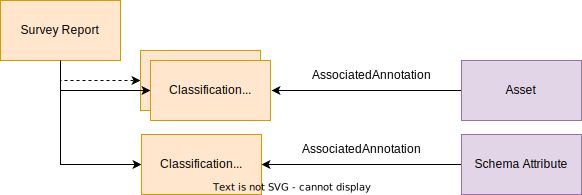
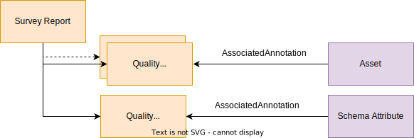
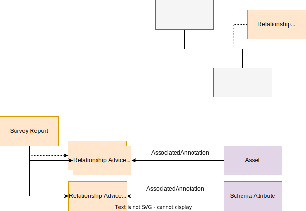
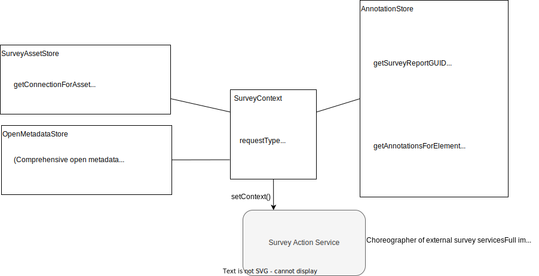

<!-- SPDX-License-Identifier: CC-BY-4.0 -->
<!-- Copyright Contributors to the Egeria project. -->

--8<-- "snippets/content-status/tech-preview.md"

# Survey Action Framework (SAF)
  
The *Survey Action Framework (SAF)* enables [metadata survey tools](/features/discovery-and-stewardship) to integrate with open metadata repositories by defining the interfaces for surveyor components (called [survey action services](/concepts/survey-action-service)) to:

- Access survey request configuration.
- Search for [assets](/concepts/asset) and related metadata in the metadata repository.
- Extract all the metadata known about a specific asset.
- Record the results of the analysis in the open metadata repository and attach it to the asset's metadata for later processing.

The results of the analysis are stored in a [*survey report*](#survey-report).

## Survey report

The survey report is created automatically in the open metadata repository when the survey action service is started.  It is linked to the asset that describes the digital resource.

The results of the analysis are published by the survey acton service to the open metadata repository as [*annotations*](#annotations).
The *survey report* lists the [annotations](#annotations) that were created during the execution of a [survey action service](/concepts/survey-action-service).  Each annotation may also link to a metadata entity that it describes.  For example, if the annotation describes the data in a particular column of a CSV file, it may also be linked to the [Schema Attribute](/types/5/0505-Schema-Attributes) entity that describes that column.

Annotations are published to report as soon as they are created by the survey action service, so it is possible to process the annotations from a long-running survey before it has completed.

### Annotations

An *annotation* describes one or more related properties about an [asset](/concepts/asset) that has been surveyed by a [survey action service](/concepts/survey-action-service).

Different types of annotations provide different types of information.

| Annotation type                        | Description                                                                                                                                                                                          |
|----------------------------------------|------------------------------------------------------------------------------------------------------------------------------------------------------------------------------------------------------|
| Classification annotation              | Captures a recommendation of which classifications to attach to this asset. It can be made at the asset or data field level.                                                                         |
| Data class annotation                  | Captures a recommendation of which data class this data field closely represents.                                                                                                                    |
| Data profile annotation                | Captures the characteristics of the data values stored in a specific data field in a data source.                                                                                                    |
| Data profile log annotation            | Captures the names of the log files where profile characteristics of the data values stored in a specific data field. This is used when the profile results are too large to store in open metadata. |
| Data source measurement annotation     | Collects arbitrary properties about a data source.                                                                                                                                                   |
| Data source physical status annotation | Documents the physical characteristics of a data source asset.                                                                                                                                       |
| Relationship advice annotation         | Documents a recommended relationship that should be established with the asset.                                                                                                                      |
| Quality annotation                     | Documents the calculated quality scores on different dimensions.                                                                                                                                     |
| Semantic annotation                    | Documents suggested meanings for this data based on the values and name of the field.                                                                                                                |
| Semantic annotation                    | Documents details of an issue or situation that needs a steward's attention.                                                                                                                         |

#### Schema extraction

For digital resources that include structured data, *schema extraction* documents the data fields present in the digital resource as a schema.

Schema extraction uses the [schema analysis annotation](/types/6/0615-Schema-Extraction).  It is linked directly off of the survey report.

[Data field](/types/6/0615-Schema-Extraction) entities, one for each data field in the digital resource, are then linked together to show the structure of the data in the digital resource and this structure is linked off of the schema analysis annotation.

The schema of the data in the digital resource is defined in a *SchemaType* linked from the digital resource's asset using the *AssetSchemaType* relationship.  This may be established before the survey action service runs, or may be derived by the survey action service.

#### Data profiling

Profiling analysis looks at the data values in the resource and summarizes their characteristics.  There are three types of annotations used in data profiling.

* [Data Profile Annotation](/types/6/0620-Data-Profiling) - Capture the characteristics of the data values stored in a specific data field in a data source.
* [Data Profile Log Annotation](/types/6/0620-Data-Profiling) - Capture the named of the log files where profile characteristics of the data values stored in a specific data field.  This is used when the profile results are too large to store in open metadata.
* [Fingerprint Annotation](/types/6/0620-Data-Profiling) - Capture the characteristics of the data values stored in a specific data field or the whole digital resource and express it as a single value.

For structured data, data profiling needs to run after schema extraction to allow the data profiling annotations that refer to a specific data field to be linked from the appropriate data field entity.

#### Data class discovery

Data class discovery captures the analysis on how close a data field matches the specification defined in a [data class](/concepts/data-class).

The recommendation for a specific data class are stored in a [data class annotation](/types/6/0625-Data-Class-Discovery) linked off of the appropriate data field.  Data class discovery needs to run after schema extraction.  It often builds on the information provided by data profiling.

Subsequent stewardship - either automated or with human assistance - can confirm the correct assignment using the [*DataClassAssignment*](/types/5/0540-Data-Classes) relationship.

#### Semantic discovery

Semantic discovery is attempting to define the meaning of the data values in the asset. The result is a recommended glossary term stored as a [semantic annotation](/types/6/0630-Semantic-Discovery).

These annotations are the metadata discovery equivalent of the *Informal Tag* shown in [0150 - Feedback](/types/1/0150-feedback) in Area 1.  It typically takes confirmation by a subject-matter expert to convert this into a [Semantic Assignment](/types/3/0370-Semantic-Assignment).  Semantic discovery needs to run after schema extraction.  It often builds on the information provided by data profiling and data class discovery.

#### Classification discovery

Classification discovery adds recommendations for new classifications that should either be added to the asset, or to a schema attribute in the asset.  It uses the [classification annotation](/types/6/0635-Classification-Discovery) to describe the classification and its properties.
If the classification is for the asset, the classification annotation is linked off of the survey report.  If it is for a specific schema attribute, it is linked off of the corresponding data field.

#### Calculating quality scores

Quality scores describe how well the data values, typically in a data field, conform to a specification.  For example, do the values match a list of valid values.   This type of annotation is often used within a [data quality program](/features/data-quality/overview) to provide assessments of the data for different purposes.

#### Relationship discovery

Relationship discovery identifies relationships between different resources (or data fields), such as two columns that have a foreign key relationship.

It is possible to create the relationship as a relationship annotation or attach a relationship advice to the survey report.

#### Capturing measurements

The measurement annotations capture a snapshot of the physical dimensions and activity levels at a particular moment in time.  For example, it may calculate the size of the data source or the number of users accessing it.

#### Requesting stewardship action

A RequestForAction (RfA) annotation is used when a survey action service performs a test on the data (such as a [quality rule](/features/data-quality/overview)) or has discovered an anomaly in the data landscape compared to its metadata that potentially needs a steward or a curator's action.  The anomaly typically refers to the elements within the asset being surveyed.  However, it may be in other data used in the survey process.  In either case, it is possible to use a *RequestForActionTarget* relationship to identify where action is required. 

The [Stewardship Action OMAS](/services/omas/stewardship-action/overview) is designed to respond to the requests for actions (RfAs).

## Survey context

A survey action service is implemented as a specialized [connector](/concepts/connector) that is passed a *survey context* as part of its initialization process.

The *survey context* provides the [survey action service](#survey-action-service) with access to information about the survey request along with the open metadata repository interfaces.

The survey context provides parameters used by a survey action service to locate and analyze an asset and then record the results.  

### Annotation store

The annotation store provides a survey action service with methods to write [annotations](#annotation) to an open metadata repository. These annotations describe the results of the analysis performed on an asset by the survey action service.

The annotations are automatically linked to the survey report that is in turn linked off of the analysed asset.  Each annotation can also be linked to other metadata elements that is describes.

## Survey asset store

A survey action service is able to create a [resource connector](/concepts/digital-resource-connector) for the asset it is to analyze using the *survey asset store*.

## Open Metadata store

The *open metadata store* provides a search interface that enables a survey action service to locate assets and related metadata that are described in the open metadata repository.  It is also able to make updates to these elements.

## Implementation in Egeria

Survey action services run under the [Survey Action OMES](/services/omes/survey-action/overview) hosted in an [Engine Host](/concepts/engine-host).

The open metadata types for annotations are described in [area 6](/types/6) of the model.  The main entity type is called [*Annotation*](/types/6/0610-Annotations). It is extended by *DataFieldAnnotation* to distinguish annotations that refer, primarily to a data field rather than the whole asset. Other more specialist annotations extend these two basic annotation types.

--8<-- "snippets/abbr.md"
