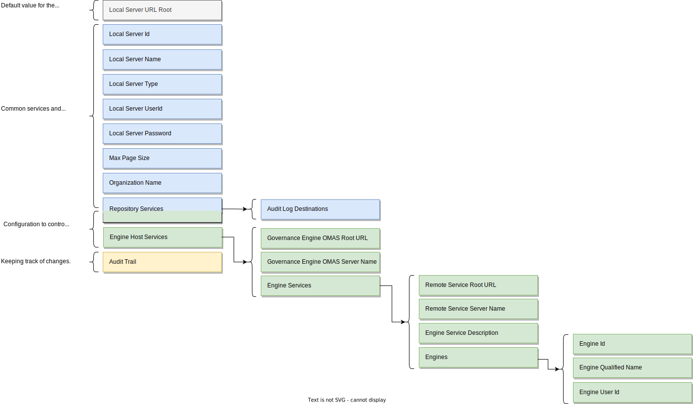

<!-- SPDX-License-Identifier: CC-BY-4.0 -->
<!-- Copyright Contributors to the Egeria project. -->

# Configuring an [engine host](/concepts/engine-host)

An *[Engine Host](/concepts/engine-host)* is configured by creating a [configuration document](/concepts/configuration-document).  Below is the outline structure of the server's configuration document.

??? deprecated "Configuration for an engine host prior to release 5.0"
    Prior to release 5.0, the list of engines to run in an engine host was configured under each engine service.  It was necessary to align the type of governance engine with the correct engine service.
    

The configuration document is built up using a series of administration calls:

??? info "Configuring the basic properties"
    --8<-- "snippets/admin/configuring-omag-server-basic-properties.md"

??? info "Configuring the audit log"
    --8<-- "snippets/admin/configuring-the-audit-log.md"

??? info "Configuring the server security connector"
    --8<-- "snippets/admin/configuring-the-server-security-connector.md"

??? info "Configuring the engine host services"
    --8<-- "snippets/admin/configuring-the-engine-host-services.md"

??? example "Example configuration of an engine host"
    This is an example of the configuration for an engine host called `engine-host`.  It is configured to run 3 engines called `FileProvisioning`, `AssetSurvey` and `AssetGovernance`.  It makes calls to the `active-metadata-store` [Metadata Access Store](/concepts/metadata-access-store).
    
    --8<-- "snippets/admin/by-server-type/engine-host-config-doc-example.md"

    This configuration document is shipped as one of the sample configurations in the `omag-server-platform` assembly.

--8<-- "snippets/abbr.md"
