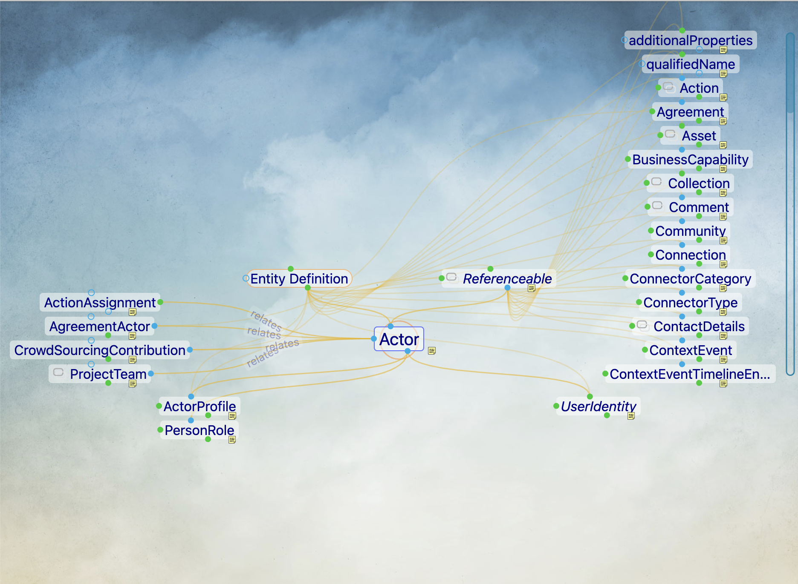
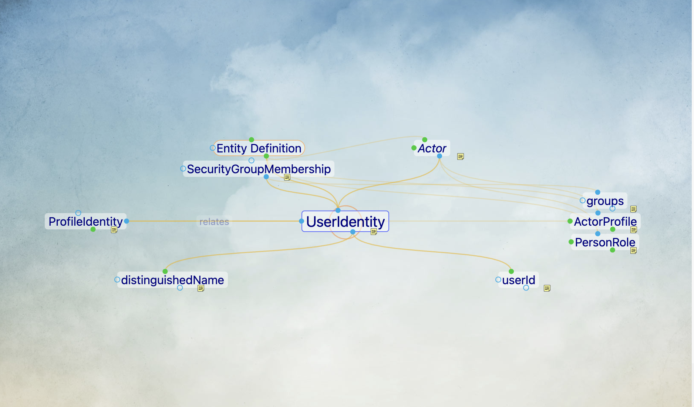

<!-- SPDX-License-Identifier: CC-BY-4.0 -->
<!-- Copyright Contributors to the Egeria project. -->

# Egeria Explorers

## Open Metadata Type Explorer

Egeria's [Open Metadata Types](/types) define an open format that can be used to represent any type of metadata.  Egeria defines a comprehensive starter set that can then be extended by organizations and vendors for their own use.  The formal definition for the open metadata types supplied by Egeria documented in the [Universal Modelling Language (UML)](https://en.wikipedia.org/wiki/Unified_Modeling_Language).  For example, the definitions of [an asset](/concepts/asset) is found on the [0010 Base Model](/types/0/0010-Base-Model) page.

The UML diagrams have the disadvantage in that it is hard to see how the types "fit together".  The *Open Metadata Type Explorer* provides an interactive graph-based visualization of the open metadata types, linked together into a single schema.  The image below shows a screenshot of the [Referenceable](/concepts/referenceable) type.

The nodes linked below it are:

* The attribute types for *Referenceable*.  They begin with a lower case letter.
* The entity types that inherit from *Referenceable*.  They begin with an upper case letter.

The types linked to the left-hand side are relationships that link a *Referenceable* to a another element.

The types linked above are either the type's super type or classifications that attach to this type.

*Referenceable* has a lot of connections.  The next screenshot is after clicking on *Actor* (see model [*0110 Actors*](/types/1/0110-Actors)).

*Actor* has three sub-types: *ActorProfile*, *PersonRole* and *UserIdentity*.  When you click on *UserIdentity*, you see it has a relationship called *ProfileIdentity*, two additional attributes called *distinguishedName* and *userId* along with a classification called *SecurityGroupMembership*.

--8<-- "snippets/abbr.md"