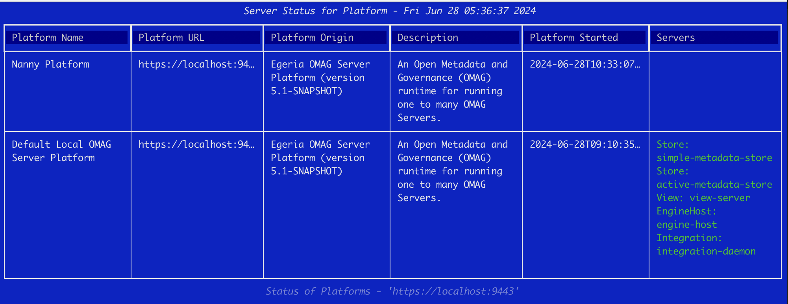

<!-- SPDX-License-Identifier: CC-BY-4.0 -->
<!-- Copyright Contributors to the Egeria project. -->

# Hey Egeria

The *hey_egeria* command line services allow interaction with the open metadata and governance services of Egeria from a command line.

The Python Widgets are a collection of examples that provide some simple but useful visualization of an Egeria environment. They 
are built with the **Rich** python package and demonstrate the use of **pyegeria** . They are installed with pyegeria
python client and may be used either as python scripts or called directly. The source code for the widgets can be found
in the pyegeria github repository at [Pyegeria Widgets](https://github.com/odpi/egeria-python/tree/690e3689a749c5de148087c626b2f5712085c9b0/examples/widgets).

As the number of widgets has grown, they have been organized by role into different sub-directories within the pyegeria distribution. 

* catalog_user - for users of the Egeria environment
* developer - for those building with, or working on Egeria
* operational - for visualizing the current state of Egeria - typically for administrators
* personal_organizer - for visualizing work and individual items

The naming convention for the widgets helps to understand their behaviour.
When the widget starts with:

* get - it will return details about a single item
* list - lists elements through a paging interface like "more" - use q to quit.
* view - provides a live view - typically of a status - use control-c to quit

## Installation
The **pyegeria** Egeria Python client can be installed from **pypi** . Python version 3.10 and above is a pre-requisite.
One common way to install Python packages is with the **pip** command. So to install **pyegeria** you can execute:

`pip install pyegeria`

This will install **pyegeria** and all of its required packages.

## Using

Once **pyegeria** is installed. The widgets may be invoked from a terminal window or shell either as a command or as a python script.
To start a widget as a command, just type its full name at the command prompt. For instance, typing:

`view_platform_status.py`

Will display a table showing the status of all running Egeria OMAG Server platforms.

Widgets can also be invoked directly if you are in the same folder as the widget (or the widgets are on the python search path).

`python3 view_platform_status.py`

All of the widgets have optional command line arguments. You can see them by setting the `--h` help flag.

Most of the widgets allow you to specify an Egeria OMAG Platform, Server (usually a view server), and user identity. 
If not specified, default values will use the Egeria default configuration with:

* platform = "https://localhost:9443"
* server = "view-server"
* user id = a user, such as **erinoverview** from the ficticious [Coco Pharmaceuticals](https://egeria-project.org/practices/coco-pharmaceuticals/) environment.

----
License: [CC BY 4.0](https://creativecommons.org/licenses/by/4.0/),
Copyright Contributors to the Egeria project.

--8<-- "snippets/abbr.md"